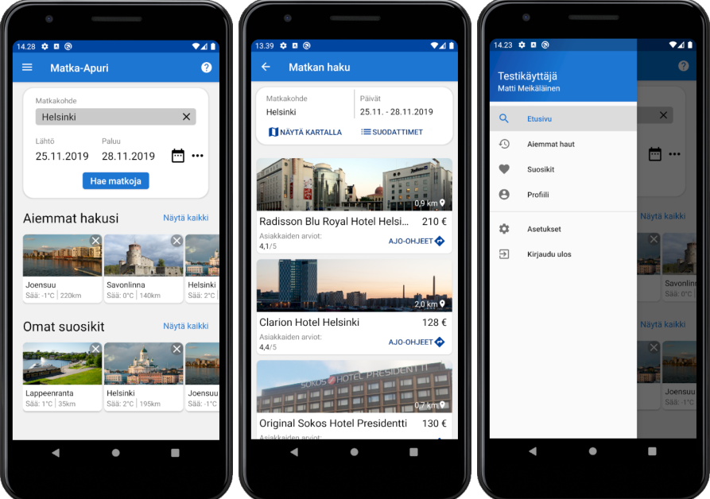

# Matka-Apuri

Matka-Apuri on ohjelmistotuotannon kurssin harjoitustyö, johon kuului mobiilikäyttöliittymien suunnittelu.
Päätin toteuttaa käyttöliittymät harjoituksen vuoksi Android Studiolla. Sovelluksen toiminta on rajallista, sillä päätarkoituksena oli vain käyttöliittymien suunnittelu. Oikeat toiminallisuudet olisi mahdollista lisätä sovellukseen myöhemmin.

